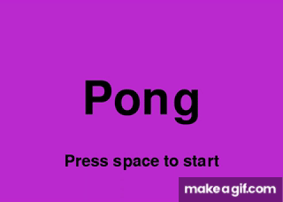

# Pong with pygame

This is a simple pong game made with pygame based on a tutorial by [101computing.net](https://www.101computing.net/pong-tutorial-using-pygame-getting-started/). I added a main menu, and other gameplay features such as puting the ball back to the center when someone scores.

## This project was coded listening to:

